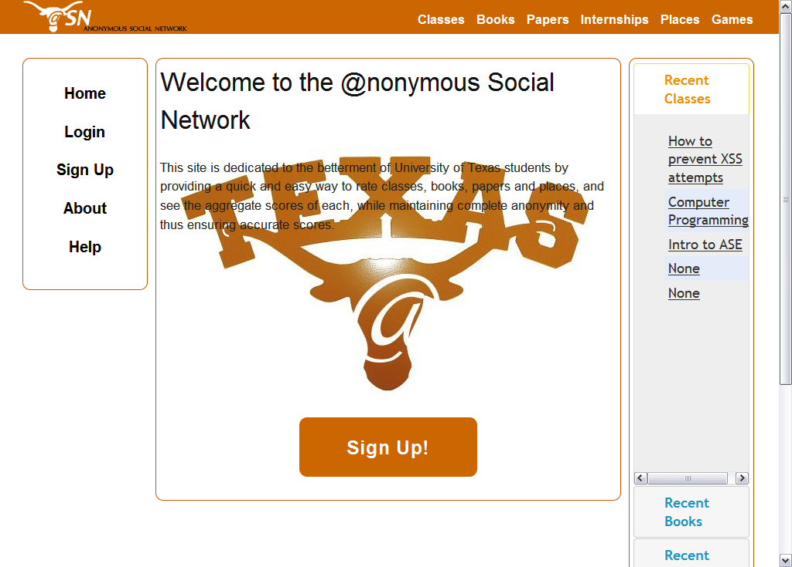

# ASN - Anonymous Social Network

This is a four-person project to implement an anonymous social network using Python, Django, jQuery, and Google App Engine.

The site lets users enter and review Textbooks, Classes, Professors, Internships, and Places. 

## Running

To run locally, have google_appengine installed in a parent folder, then

> make run

this will run the application with a database called datastore in the current folder. 
Then navigate in a browser to http://localhost:8080

<!-- To run on appspot.com, navigate to http://cs373-asn2-jkgrimes.appspot.com -->

<!-- To login as an admin, use the following account: -->
  <!-- email: admin@admin.com -->
  <!-- password: admin -->

